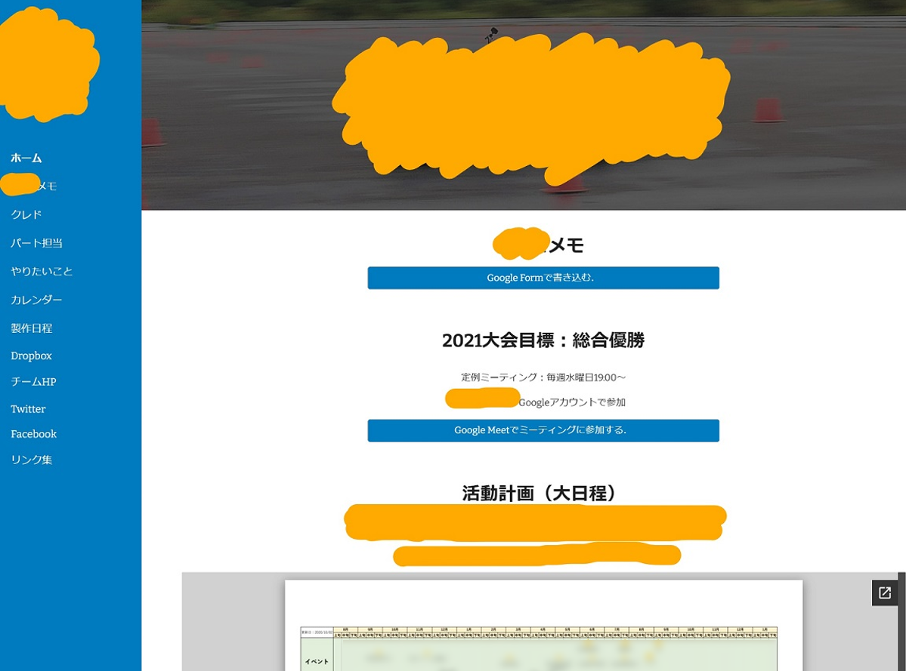

COVID-19の感染拡大の影響を受け，弊学Fチームではオンライン作業が増えた．  
情報共有を簡単にし作業効率化を図るためにGoogle Sitesでチーム内ポータルサイトを作った．

## 基本機能
- メモ
  - Google Formで書いて，Google Sheets経由で表示する．
- Google Meetへの参加ボタン
  - 普段のミーティングだけでなく，突発的な雑談でも簡単に使用できる．
- 活動計画の表示

## Google Sitesを使った理由
- 大学がG Suitを契約しており，チームメンバー全員が大学のGoogleアカウントを持っていたから．
- チームでGoogleアカウントを所有していたから．
  - チームのGoogle Calendar，Google Drive，Google Forms，Google Sheets等と連携できる．
  - このポータルサイトをチームのGoogleアカウントに紐づければ，チームメンバー全員が管理できる．

## アクセス権限
- Google Sitesのアクセス権限はチームメンバーのGoogleアカウントのみに設定
- Google Calendarも同様（Google Site内でGoogle Calendarを表示させるため）