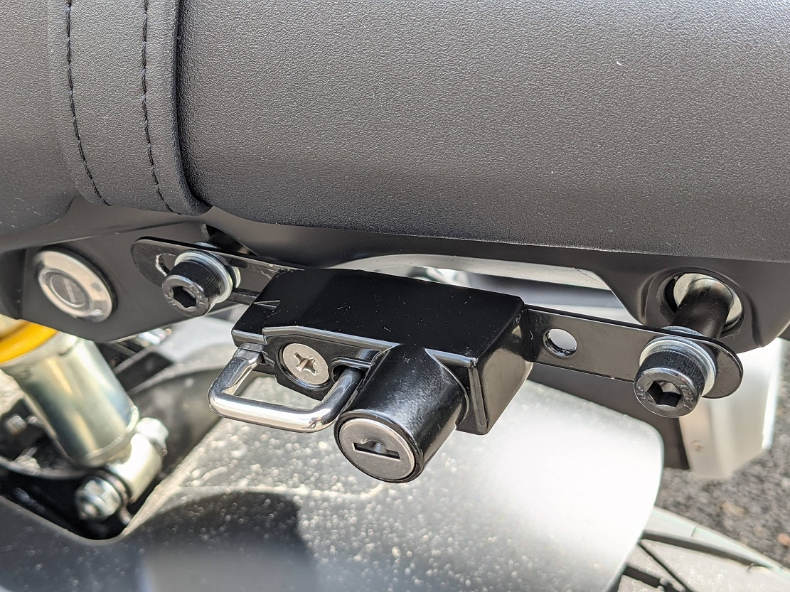

 
 

## 材料
- [KIJIMA - ヘルメットロック本体のみ](https://www.kijima.info/helmetlockuni.html) × 1
- ロックナット (M6) × 1
- ステー - 補強金具 (L:150mm) × 1
- ボルト (M8×50) × 2
- スペーサー (M8×20) × 2
- ワッシャー (M8) × 6

## ステーの加工
- ヘルメットロック本体固定用穴あけ → Φ6
- ヘルメットロック回り止め用穴あけ → Φ4
- ステー固定用穴あけ → Φ8（片側は長円）

## 取付け
シート下の車両左側キャップを外し，ねじ穴に取り付ける．

## 注意
- 取付時はグリスアップする．
- [ガルバニック腐食](https://ja.wikipedia.org/wiki/%E7%95%B0%E7%A8%AE%E9%87%91%E5%B1%9E%E6%8E%A5%E8%A7%A6%E8%85%90%E9%A3%9F)の原因となるため，ステンレスは使わない．
  - 参考：[ステンレス協会 - ステンレスと異種金属との接触についての問題点](http://www.jssa.gr.jp/contents/faq-article/q9/)
- 最初は四三酸化鉄皮膜（黒染め）六角穴付ボルトを使用していたが，3ヶ月で錆びてしまった．その後キタコ・コンビニパーツのフランジ付六角ボルト（ユニクロメッキ）に変更した．