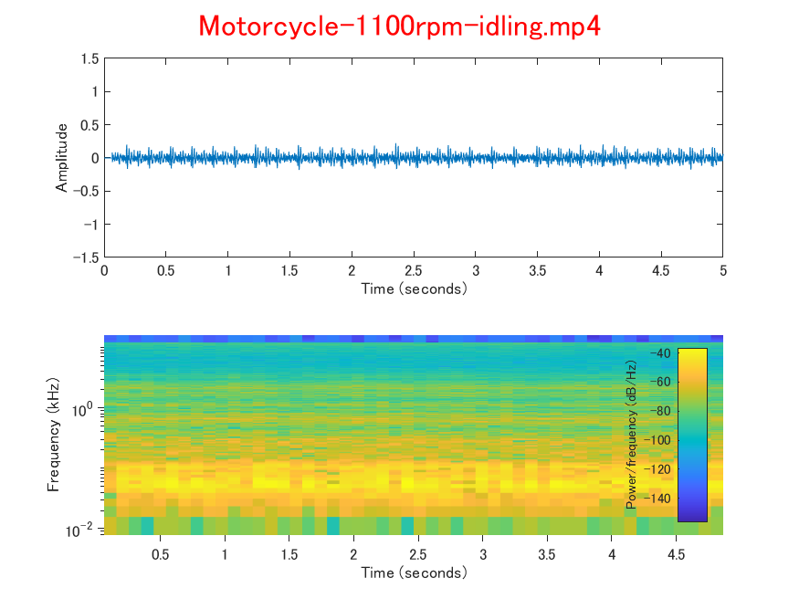
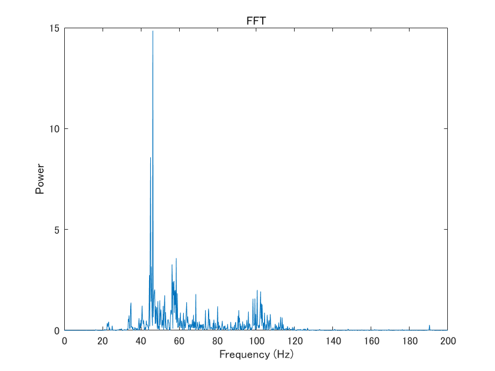
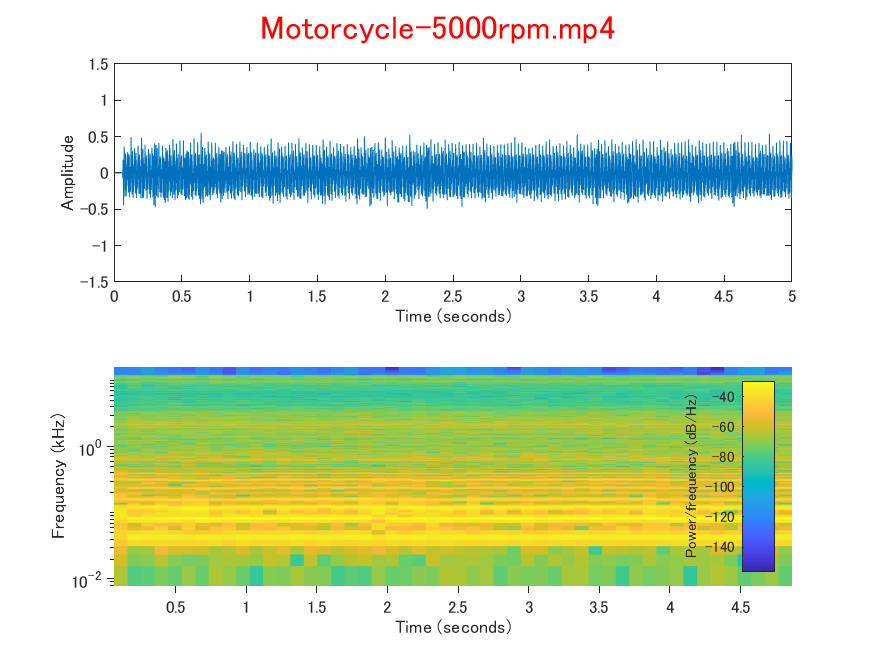
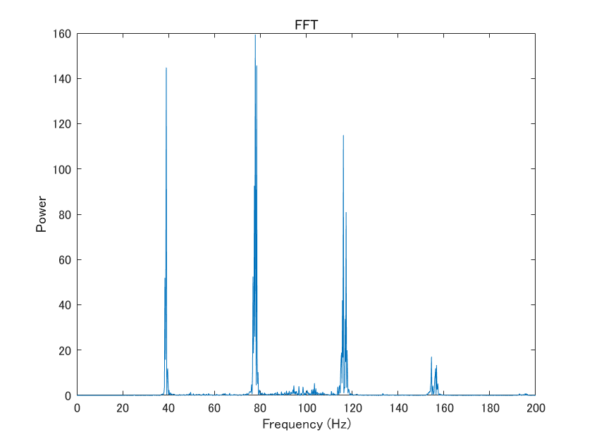
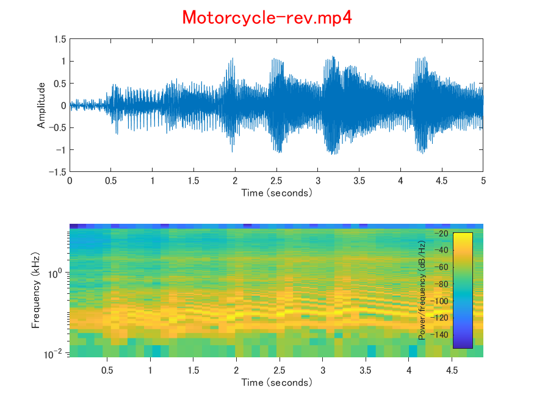
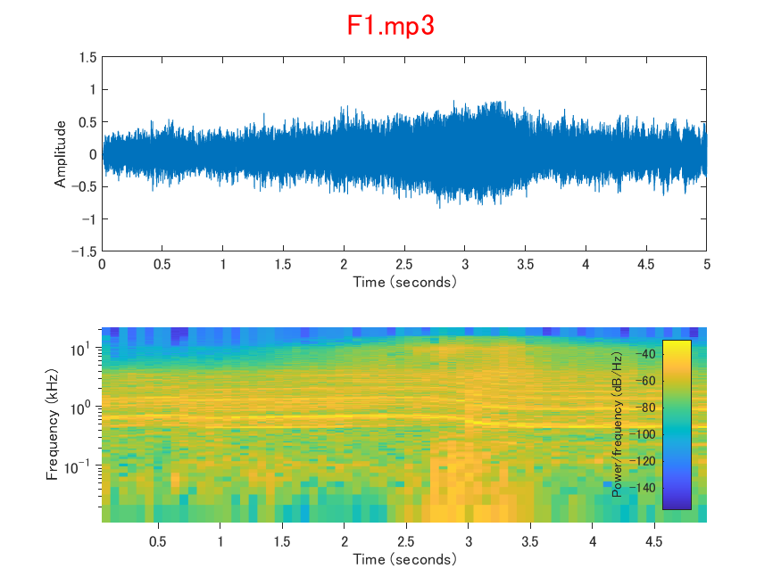
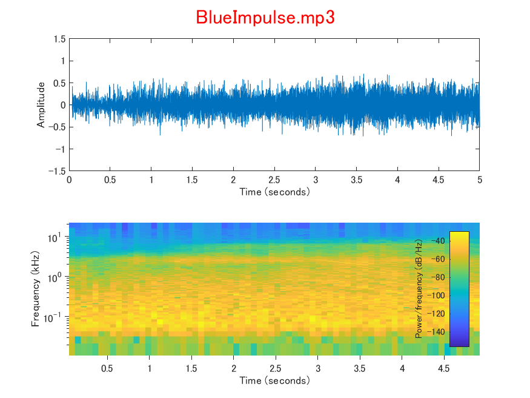

## マイク
- Google Pixel 4a

## 解析対象
- バイク
   - 125cc
   - 単気筒
   - 4ストローク
   - NA
- F1
   - 2.4L
   - V8
   - 4ストローク
   - NA
- ブルーインパルス
   - ターボファン・エンジン

## バイク
- 1100rpm

<br>
<br>


<br>
<br>
<audio src="Motorcycle-1100rpm-idling.mp4" controls></audio>
<br>
<br>

- 5000rpm

<br>
<br>


<br>
<br>
<audio src="Motorcycle-5000rpm.mp4" controls></audio>
<br>
<br>

- Revving

<br>
<br>
<audio src="Motorcycle-rev.mp4" controls></audio>
<br>
<br>

## F1

<br>
<br>

## ブルーインパルス

<br>
<br>
<audio src="BlueImpulse.mp3" controls></audio>
<br>
<br>

## 使用環境
- MATLAB R2020a
- Signal Processing Toolbox

## 参考
- [MathWorks - オーディオとビデオ](https://jp.mathworks.com/help/matlab/audio-and-video.html)
- [MathWorks - spectrogram](https://jp.mathworks.com/help/signal/ref/spectrogram.html)
- [Wikipedia - 短時間フーリエ変換](https://ja.wikipedia.org/wiki/%E7%9F%AD%E6%99%82%E9%96%93%E3%83%95%E3%83%BC%E3%83%AA%E3%82%A8%E5%A4%89%E6%8F%9B)
- [MATLABによる音声信号処理入門](https://www.jstage.jst.go.jp/article/itej/66/2/66_130/_article/-char/ja/)

## ソースコード
```engine_sound_analysis.m
clear all;
close all;
clc;

% ファイル名
filename = 'filename';

% オーディオファイルに関する情報取得
info = audioinfo(filename)

% オーディオファイル読み込み（5秒分だけ）
samples = [1,5*info.SampleRate];
[y,Fs] = audioread(filename,samples,'double');

% ステレオ→モノラル
if size(y,2)
    yMono = sum(y,2) / size(y,2);
    y = yMono;
end

% 振幅グラフ
subplot(2,1,1);
plot(0:1/Fs:(length(y)-1)/Fs,y);
xlabel('Time (seconds)');
ylabel('Amplitude');
ylim([-1.5 1.5]);

% スペクトログラム
Nw = 4096;    % フレーム長
No = 1024;    % フレームシフト長（オーバーラップ1/4）

subplot(2,1,2);
spectrogram(y,Nw,No,Nw,Fs,'yaxis');
ax = gca;
ax.YScale = 'log';                % 対数表示
xlabel('Time (seconds)');
ylabel('Frequency (kHz)');

% カラーバー位置変更
colorbar('off');
c = colorbar('east');
c.Label.String = 'Power/frequency (dB/Hz)';

% サブプロットのタイトル
sgt = sgtitle(filename,'Color','red');
sgt.FontSize = 16;

% グラフを保存
[filepath,name,ext] = fileparts(filename);
saveas(gcf,strcat(name,'.png'));

% オーディオファイル再生
playerObj = audioplayer(y,Fs);
play(playerObj);
```