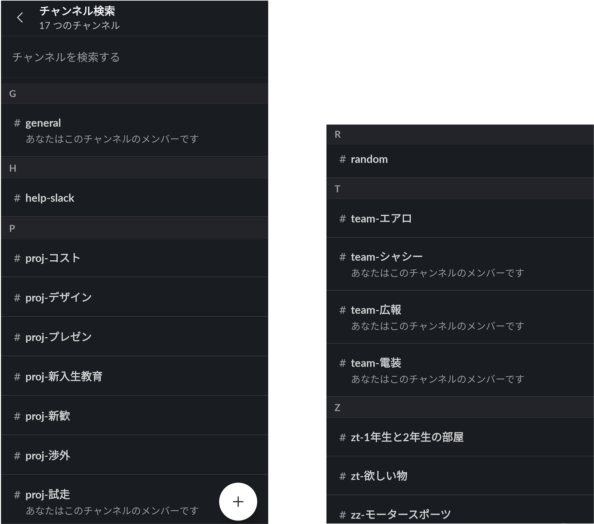

後輩と協力して弊チームにSlackを導入した．

## 作ったチャンネル一覧

 
 

## チャンネル名について
見やすさや使いやすさに関わるので明確なルールを設けた．
- 全体連絡 → #general
- 全体の雑談 → #random
- プロジェクト → proj-
- チーム → team-
- イベント（飲み会など）→ event-
- times（独り言用）→ times-
- ヘルプ → help-
- 補助チャンネル → zt-
- ただの雑談 → zz-

## 参考
- [slack help center - チュートリアル](https://slack.com/intl/ja-jp/help/categories/360000049063)
- [slack help center - チャンネル名のガイドラインを作成する](https://slack.com/intl/ja-jp/help/articles/217626408-%E3%83%81%E3%83%A3%E3%83%B3%E3%83%8D%E3%83%AB%E5%90%8D%E3%81%AE%E3%82%AC%E3%82%A4%E3%83%89%E3%83%A9%E3%82%A4%E3%83%B3%E3%82%92%E4%BD%9C%E6%88%90%E3%81%99%E3%82%8B)