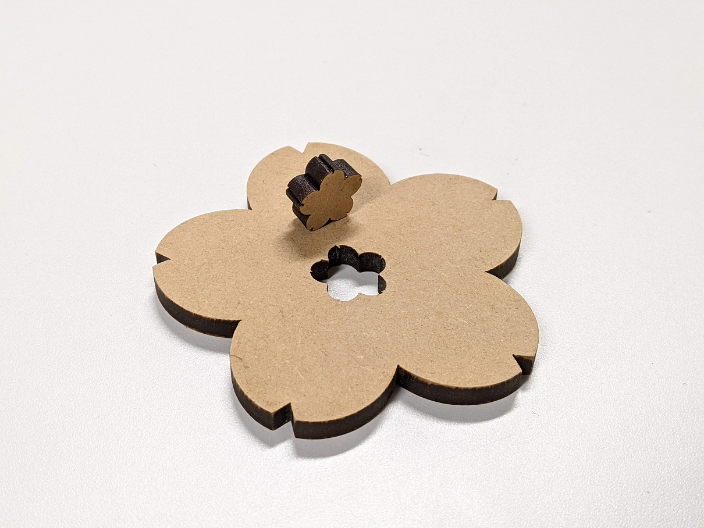

 
 

## 加工データ作成ソフト
- Adobe Illustrator 25 (2021)

## 材料
- MDF (厚さ5.5mm)

## 使用装置
- trotec - Speedy100

## 加工条件

| Parameters | Settings |
| :--- | ---: |
| Power [%] | 100 |
| Speed [%] | 0.5 |
| Frequency [Hz] | 1000 |
| Pass [count] | 1 |
| Air Assist | On |
| Z-offset [mm] | 0 |

## 参考
- [trotec - 取扱説明書 （操作マニュアル）](https://www.troteclaser.com/ja/contact/technical-support/manuals/)
- [trotec - パラメーター設定の各項目にはどのような意味がありますか？](https://www.troteclaser.com/ja/knowledge/tips-for-laser-users/laser-parameters-definition/)