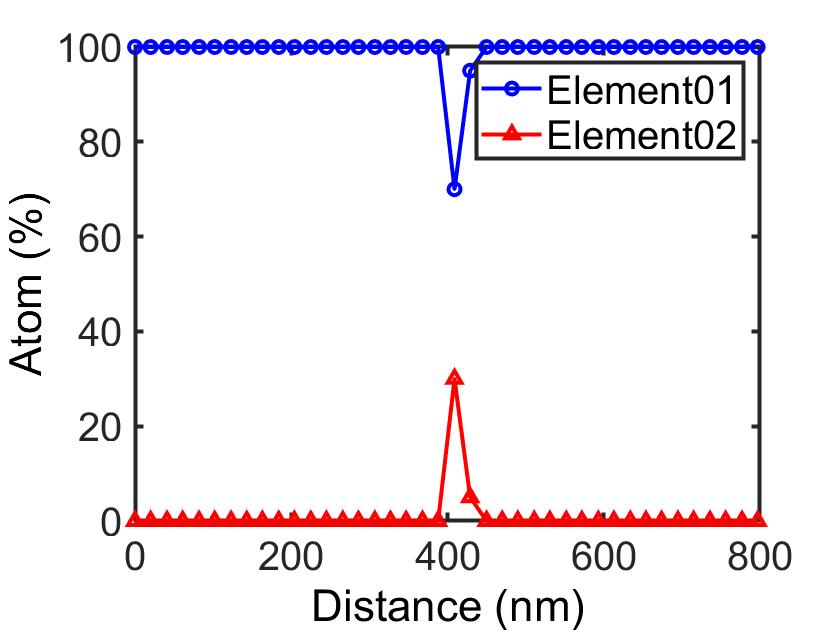

<br>
<br>

## 概要
同一座標軸に複数データをプロットしたグラフの作成例

## ソースコード
```graph.m
clear all;
close all;
clc;

% Parameters
fontname = 'Arial'
fontsize = 20;
color = 'k';

% Load files
filename = 'original_filename';
load(strcat(filename,'.mat'));

% Plot
figure;
plot(data.Distance,data.element01,'-bo',data.Distance,data.element02,'-r^','LineWidth',2,'MarkerSize',6);


% Grid
grid off;

% Axis limits
axis([0 800 0 100]);

% Legend
legend('Element01', 'Element02','Fontsize',fontsize,'FontName',fontname,'TextColor',color);

% Axis
xlabel('Distance (nm)','FontSize',fontsize,'FontName',fontname,'Color',color);
ylabel('Atom (%)','FontSize',fontsize,'FontName',fontname,'Color',color);
ax = gca;
ax.FontName = fontname;
ax.FontSize = fontsize;
ax.GridColor = color;
ax.MinorGridColor = color;
ax.LineWidth = 2;
```