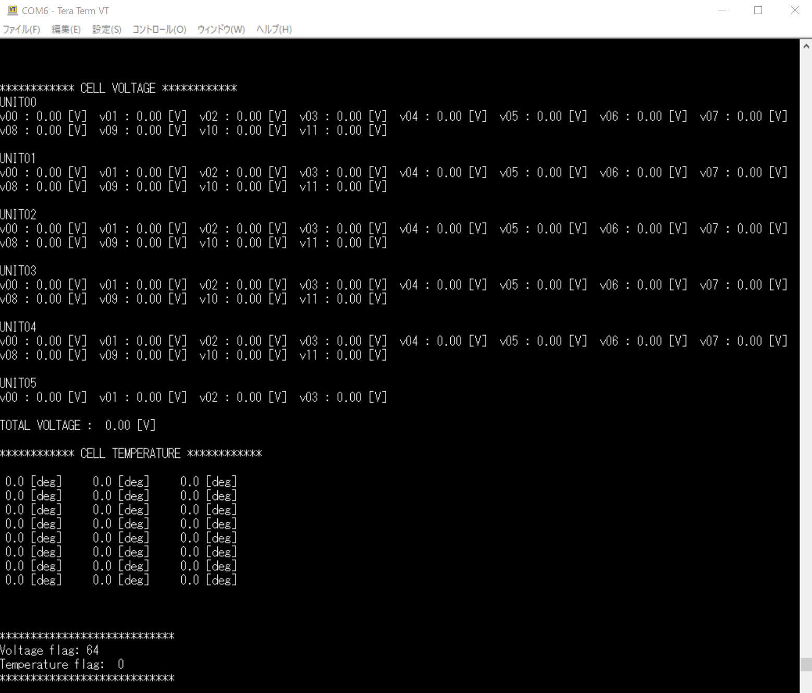

## BMSの概要
セル電圧が定格外，またはセル温度が60℃以上の場合に，シャットダウン回路上にあるリレーを開いて，AIRへの電源を断ち，高電圧システムをシャットダウンする．
本車両では，バッテリーセルを8セルごとにまとめて1つのモジュールとしている．
各セグメントごとに8セル（モジュール全体の100%）の電圧と，3セル（モジュール全体の37.5%）の温度を監視している．

## ハードウェア
1. Microcontroller board
    - Nucleo-F401RE
      - これがマスターである．セル電圧およびセル温度のデータ取得にはSPI通信を用いた．
    - Pin assignment
      - SPI
        - MOSI : D11
        - MISO : D12
        - SCLK : D13
        - CS for LTC6804-1 : D10
        - CS for ADC00 (Thermistor) : D5
        - CS for ADC01 (Thermistor) : D6
        - CS for ADC02 (Thermistor) : D7
      - BMS status signal (for Relay) : D4
      - LED : A0~A4
1. Voltage measurement
    - BMS chip : [LTC6804-1](https://www.analog.com/jp/products/ltc6804-1.html)
    - BMS Demonstration circuit : [1894B](https://www.analog.com/jp/design-center/evaluation-hardware-and-software/evaluation-boards-kits/dc1894b.html)
    - isoSPI™ chip : [LTC6820](https://www.analog.com/jp/products/ltc6820.html)
    - isoSPI™ transceiver board : [1941](https://www.analog.com/jp/design-center/evaluation-hardware-and-software/evaluation-boards-kits/dc1941d.html)
1. Temperature measurement
    - Thermistor : [103JT-050](http://www.semitec.co.jp/products/thermo/thermistor/jt/)
    - A/D converter : [MCP3008](http://akizukidenshi.com/catalog/g/gI-09485/)
1. PCB
    - ~~実機動作確認済~~ → シャットダウンシグナルを誤って5V出力としていた．正しくは3.3V→12Vで出力しなければならない．また，そもそも3.3V→5V出力の回路も間違っていた．再設計が必要．  
      - Schematic: BMS_20200905.sch
      - Board: BMS_20200905.brd
    - ~~最新版（配置等の微修正，実機未検証）~~
      - ~~Schematic: BMS_20201230.sch~~
      - ~~Board: BMS_20201230.brd~~

## ソフトウェア
1. [Mbed](https://os.mbed.com/)
    - プログラムのコンパイルに使用した．
    - チュートリアル：[mbedを始めましょう！("Let's get started!" in Japanese)](https://os.mbed.com/users/nxpfan/notebook/lets_get_started_jp/)
1. [Tera Term](https://ttssh2.osdn.jp/index.html.ja)
    - NucleoとPCをUSBで繋ぎ，セル電圧およびセル温度を測定する際に使用した．

## Tera Termでの表示
Newline code(改行コード) : LF  


## ソースコード（オリジナルの部分のみ）
諸事情により"????"としている部分がある．
関数等は[LTC6804-1/ツール/Linduino](https://www.analog.com/jp/products/ltc6804-1.html#product-tools)を参照．  
更新：2023/08/18（main関数において，tmp_fgとvol_fgが割り込み後に未更新だったバグを修正した．S.S.に感謝！）


```main.cpp
// ----------Variable declaration----------
// I/O settings
SPI spi(D11, D12, D13);         // MOSI, MISO, SCLK
DigitalOut cs_spi(D10);         // CS for LTC6804-1
DigitalOut cs_thr00(D5);        // CS for ADC00 (Thermistor)
DigitalOut cs_thr01(D6);        // CS for ADC01 (Thermistor)
DigitalOut cs_thr02(D7);        // CS for ADC02 (Thermistor)
DigitalOut tr_sw(D4);           // BMS status signal for flip-flop circuit

// LED settings
DigitalOut LED_00(A0);
DigitalOut LED_01(A1);
DigitalOut LED_02(A2);
DigitalOut LED_03(A3);
DigitalOut LED_04(A4);

// USB serial output
Serial pc(USBTX, USBRX);

// Recurring  timer interrupt
Ticker adc_sampling;

// Temperature and Voltage flags
int tmp_fg = 0;
int vol_fg = 0;

// Temperature and Voltage flags (when you use timer interruption)
// volatile int tmp_fg = 0;
// volatile int vol_fg = 0;


// ----------Various function----------
// Convert ADC values to temperature
float Calc_temp(float adc_v)
{
    float T = 0;                // Temperature[K]
    float T0 = 298.15;          // [K]
    float B = 3435;             // B constant of NTC thermistor
    float R0 = 10000;           // 10*10^3 [Ohm]
    float Rt = 0;               // Thermistor [Ohm]

    Rt = (5.0/adc_v - 1) * 10000;   // Voltage divider
    T = 1/(1/T0 + 1/B*log(Rt/R0));  // [K]
    
    return(T-273.15);            // [degree Celsius]
}

// Select MCP3008 and its channel
// Receive ADC results
float adc_spi(int ic_num, int ch_num)
{
  // MCP3008 SPI communicationdatasheet: ????, p.19, 22
  int TD0 = 0x01;                  // MCU Transmitted Data 0 (start bit)
  int TD1 = 0x00;                  // MCU Transmitted Data 1 (initialization)
  int TD2 = 0x00;                  // MCU Transmitted Data 2 ("Don't Care" Bits)
  
  int highByte, lowByte = 0;
  TD1 = (ch_num + 8 ) << 4;
  
  switch(ic_num) {
    case 0:
        cs_thr00 = 0;
        spi.write(TD0);
        highByte = spi.write(TD1);
        lowByte = spi.write(TD2);
        cs_thr00 = 1;
        break;
    
    case 1:
        cs_thr01 = 0;
        spi.write(TD0);
        highByte = spi.write(TD1);
        lowByte = spi.write(TD2);
        cs_thr01 = 1;
        break;

    case 2:
        cs_thr02 = 0;
        spi.write(TD0);
        highByte = spi.write(TD1);
        lowByte = spi.write(TD2);
        cs_thr02 = 1;
        break;

    default:
        cs_thr00 = 1;
        cs_thr01 = 1;
        cs_thr02 = 1;
        break;
  }

  // Arrange the format of ADC results
  return (((highByte & 0x03) << 8) + lowByte)*5.0/1024.0;	// 10bit ADC --> 5[V] / 10[bits] = 0.00488[V/bits]
}

// Get cell voltage from 1894B board (LTC6804-1)
// BMS max limit:????[V]
// BMS minimum limit:????[V]
// Datasheet: ????
int fg_ltc6804()
{
  uint8_t wrcfg[6][6];          // Setting commands
  uint16_t data[6][12];         // Cell volatage
  float vol_data[6][12];        // Cell volatage
  float v_total = 0;            // Total voltage
  uint8_t vf[6][8];				      // Not using

  vol_fg = 0;                   // Voltage flag reset

  // Refer to Table.36 on datasheet
  // Board i (i:0~5)
  for(int i = 0; i < 6; i++) {
    wrcfg[i][0] = 0xF8;           //CFGR0
    wrcfg[i][1] = 0x4C;           //CFGR1
    wrcfg[i][2] = 0x38;           //CFGR2
    wrcfg[i][3] = 0xA0;           //CFGR3
    wrcfg[i][4] = 0x00;           //CFGR4
    wrcfg[i][5] = 0x00;           //CFGR5
  }

  // Execute LTC6804 function 
  LTC6804_initialize();
  LTC6804_wrcfg(6, wrcfg);
  LTC6804_adcv();                                             // Measure each cell voltage
  int rv_fg = LTC6804_rdcv(0, 6, data);                       // (All Register, Number of connection, Data storage)
                                                              // LSB of data is 100[uV]
  LTC6804_rdst_reg(2, 6, *vf);								                // Not using（B固定，接続数，データ保存先）

  // Calculate total voltage
  for(int i = 0; i < 6; i++){
    pc.printf("UNIT%02d\n", i);                               // Display LTC6804 board number
    for(int j = 0; j < 12; j++){
      vol_data[i][j] = data[i][j] * 0.0001;                   // Convert the range
      if(!(((i == 2 || i == 5) && (3 < j && j < 6)) || ((i == 2 || i == 5) && (9 < j)))){                       // data[5][4]~data[5][11] are not using because there are only ???? cells.
        if((vol_data[i][j] > ????) || (vol_data[i][j] < ????)){ // Check each cell voltage level (Max:????[V], Min:????[V])
          vol_fg += 1;                                        // Voltage flag
        }
        v_total += vol_data[i][j];                            // Total voltage
        pc.printf("v%02d : %4.2f [V]  ", j, vol_data[i][j]);  // Display voltage status
      }
    }
    pc.printf("\n\n");
  }
  pc.printf("TOTAL VOLTAGE : %5.2f [V]\n\n", v_total);				  // Display Total voltage
  return vol_fg;
}

// Get cell temperature from thermistor (103JT-050)
// Datasheet: ????
int thermistor()
{
  float bt_tmp[8][3] = {{0}};                       // Battery temperature (1 module-->3 thermistors, ???? has ???? modules.)
  
  tmp_fg = 0;                                       // Temperature flag reset

  for(int i = 0; i < 8; i++){
    for(int j = 0; j < 3; j++){
      bt_tmp[i][j] = Calc_temp(adc_spi(j, i));      // Get temperature data
      if(bt_tmp[i][j] > 60.0){                      // Check cell temperature (Max:60.0[deg])
        tmp_fg += 1;
      }
      pc.printf("%4.1f [deg]    ", bt_tmp[i][j]);    // Display temperature status
    }
    pc.printf("\n");
  }
  pc.printf("\n\n");
  return tmp_fg;
}

// Interrupt function
void interrupt()
{
  pc.printf("************ CELL VOLTAGE ************\n");
  vol_fg = fg_ltc6804();                            // Voltage
  pc.printf("************ CELL TEMPERATURE ************\n\n");
  tmp_fg = thermistor();                            // Temperature
  
  // Display flags
  pc.printf("\n****************************\n");
  pc.printf("Voltage flag: %2d\n", vol_fg);
  pc.printf("Temperature flag: %2d\n", tmp_fg);
  pc.printf("****************************\n\n\n\n");
}

int main()
{
  tr_sw = 1;                    // Normally HIGH (BMS status signal)
  
  // SPI settings
  spi.format(8,3);              // 8bits, Mode 3
  spi.frequency(500000);        // 500[kHz]

  // Wait 1[sec]
  wait(1);
  
  // Timer interrupts by 1[sec]
  // adc_sampling.attach(&interrupt, 1);

  // Checking flags
  while(1){
    interrupt();                // not timer interruption
    pc.printf("vol_fg is %d\n",vol_fg);
    pc.printf("tmp fg is %d\n",tmp_fg);

    if(tmp_fg > 0 || vol_fg > 0){
      tr_sw = 1;                // BMS shutdown signal
    } else {
      tr_sw = 0;                // No problem
    }
    wait(1);
  }
}

```