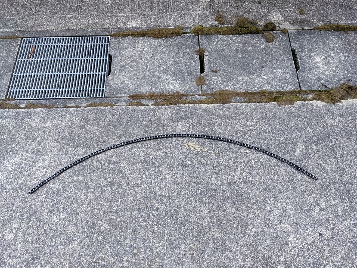
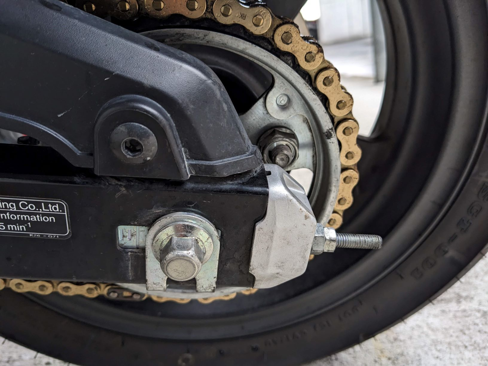
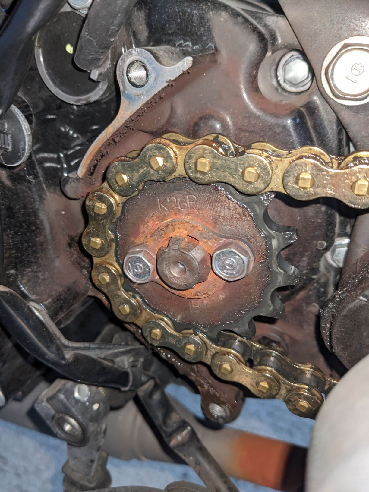
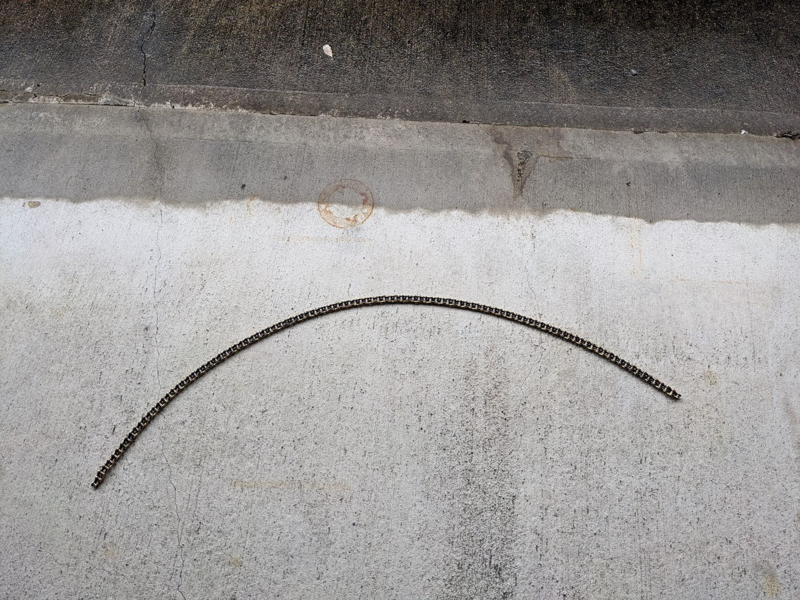
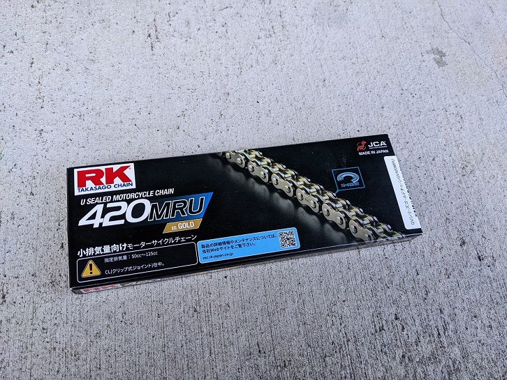

## チェーン交換履歴
1. 約7000km（初回），純正チェーン→シールチェーン
    - 取り外し後
      
       
       
1. 約14000km，シールチェーン→シールチェーン
    - 取り外し前
      
       
      
       
    - 取り外し後
      
       
       

## 型番
- RK JAPAN GV420MRU（リンク数：108）
  
   
   

## 参考
- [D.I.D - MAINTENANCE](http://didmc.com/maintenace/)