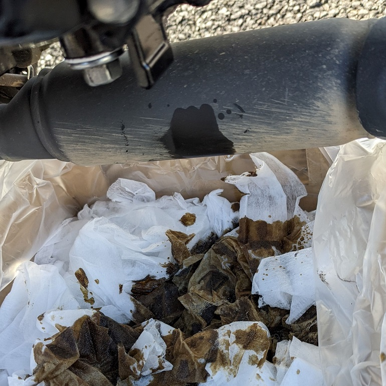
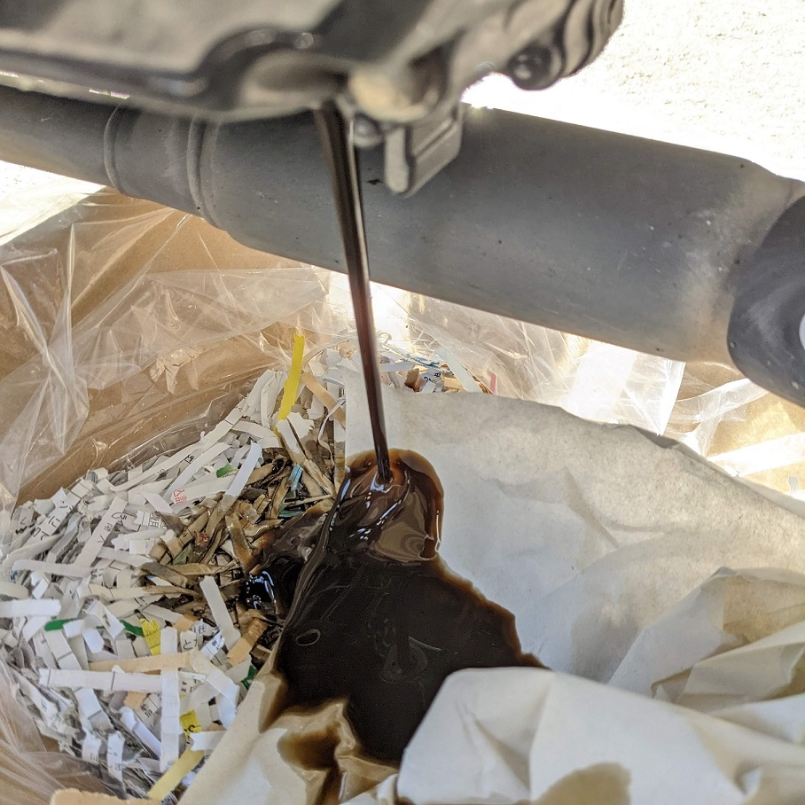
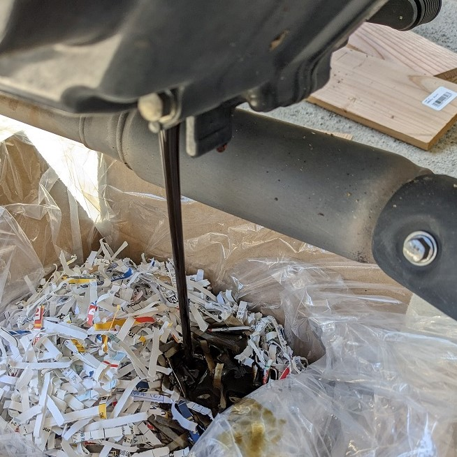
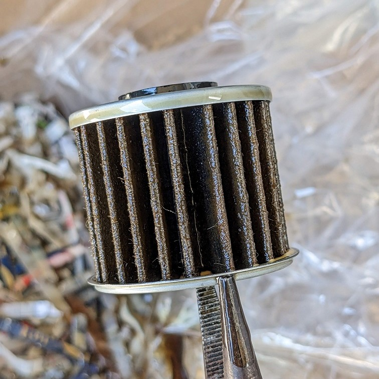

## エンジンオイル交換履歴
1. 約1000km（初回），オイルフィルター交換
1. 約4000km
    
 
 
1. 7558km
    
 
 
1. 約10500km
    
 
    
 

## 型番
- エンジンオイル：Honda ウルトラ G1 SL 5W-30 1L
- ドレンワッシャー：デイトナ ドレンワッシャー M12 厚さ1.7mm 10枚入り 75420
- オイルフィルター：KITACO オイルエレメント H-06（KITACO K-PIT オイル交換フルセットを購入）

## 参考
- [Honda - 定期交換部品について](https://www.honda.co.jp/maintenance-motor/exchange/exchange.html)