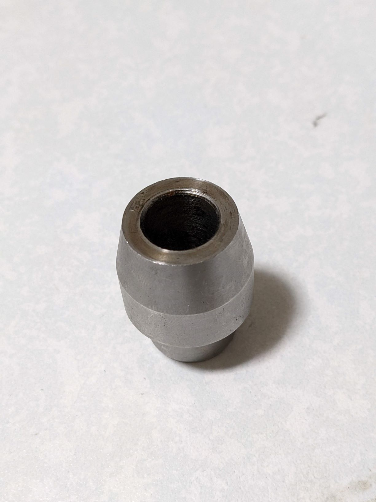

## タイヤ交換履歴
1. 約8500km（リアのみ）
    - 型番：IRC MOBICITY SCT-001 130/70-12 62L 122542
    - メモ
      - 手組にトライした．色々手間取りほぼ1日かかった．ホイールのリムを傷つけずに作業するのは結構難しい．
      - 最後の組付け時にハブ/ホイール間のスリーブ↓を忘れて作業をやり直した...
        

 
 
1. 約xxxxxkm

## 型番
- エアバルブ：Dunlop PVR-70 208271
- タイヤレバー/リムプロテクター：デイトナ タイヤレバーセット95397
- タイヤレバー：エーモン タイヤレバー 全長360mm T767
- ビードブレーカー：アストロプロダクツ モーターサイクルビードブレーカー 2007000011263
- ビードワックス：マルニ工業 ビードワックス40g B.PW-109

## 参考
- [Dunlop - Dictionary of TYRE](https://dunlop-motorcycletyres.com/dictionary/safe_use/)