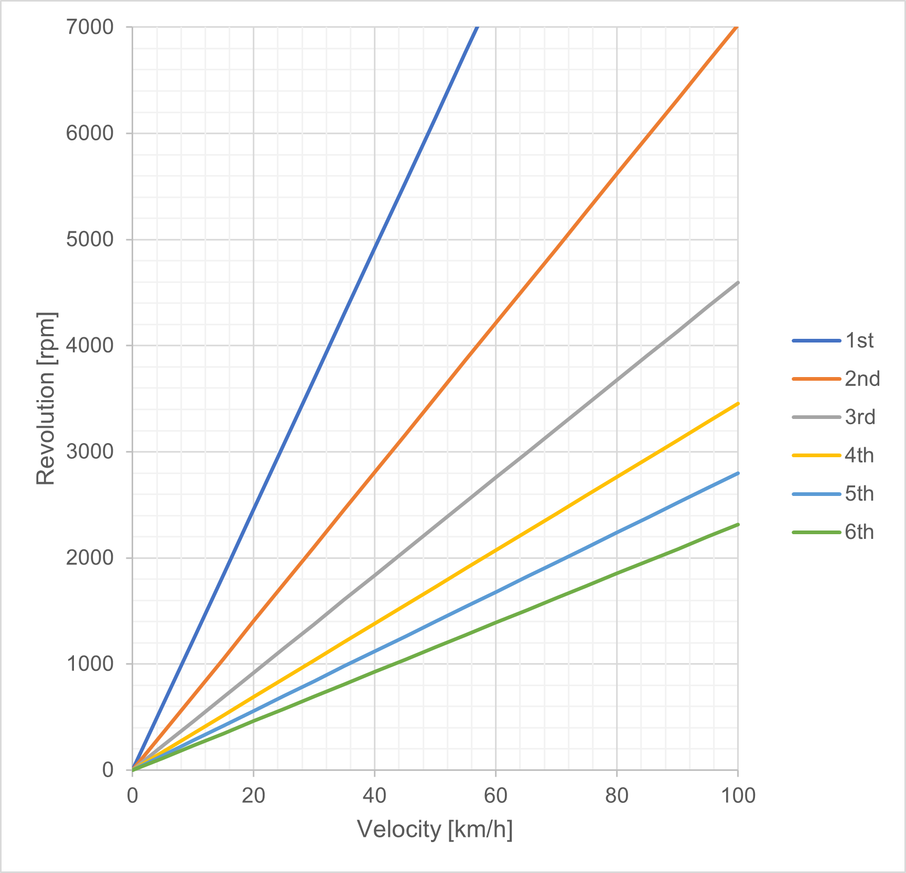

## 諸元
- タイヤの外径（235/40R18）：645[mm]
- 減速比：4.105
- 変速比
| |1速| |2速| |3速| |4速| |5速| |6速|
|:----|:----|:----|:----|:----|:----|:----|:----|:----|:----|:----|:----|
|変速比|3.642| |2.08| |1.361| |1.023| |0.829| |0.686|
|各ギア間の総減速比の比率| |57%| |65%| |75%| |81%| |83%| |
 
 

## 各ギアにおける速度とエンジン回転数の関係

 
 