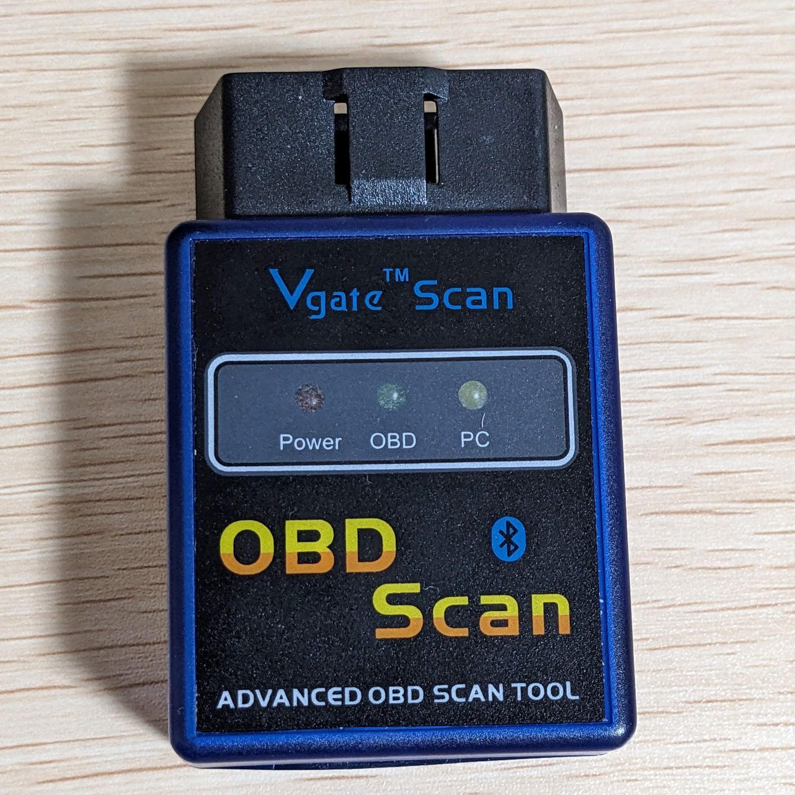
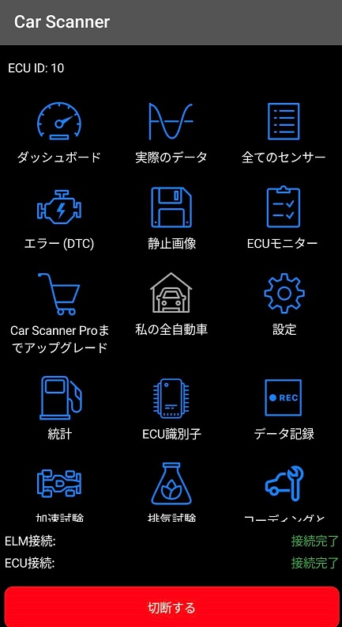
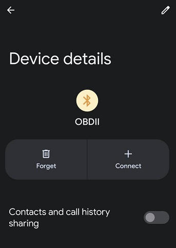
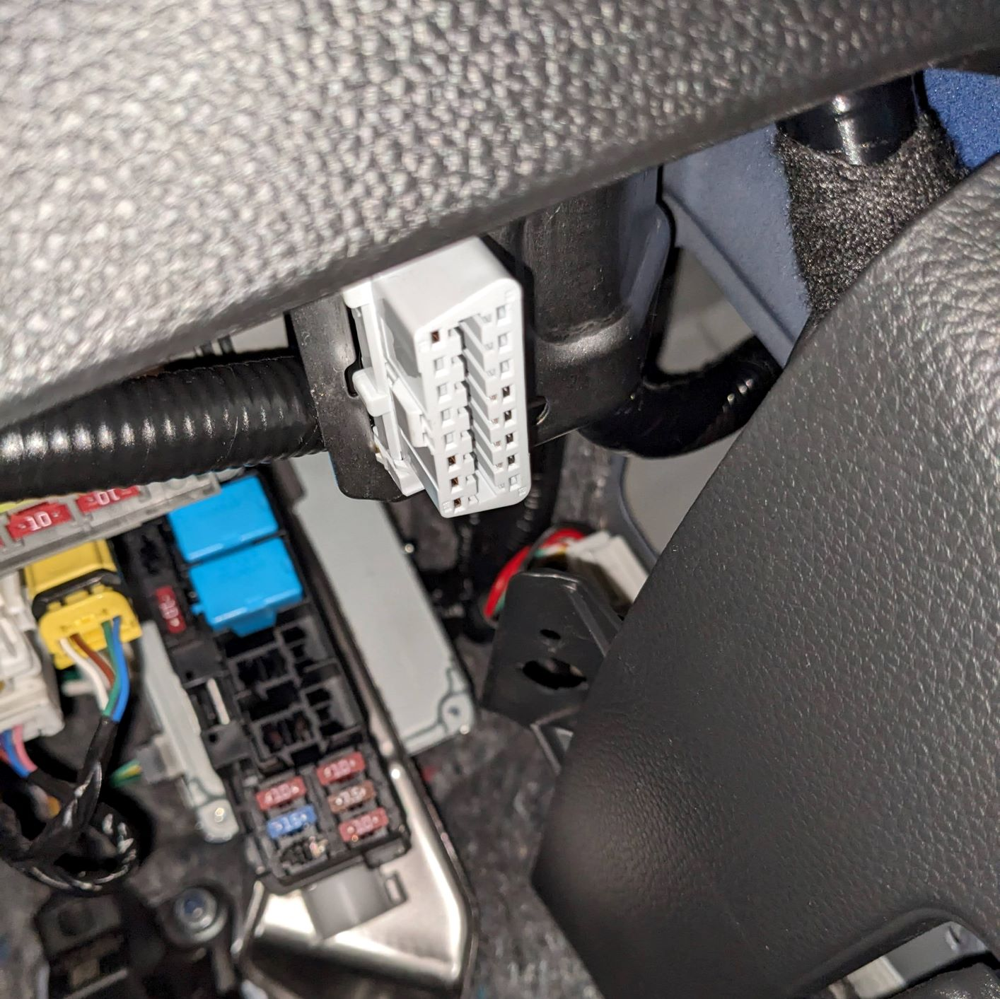
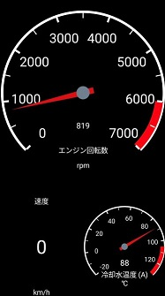
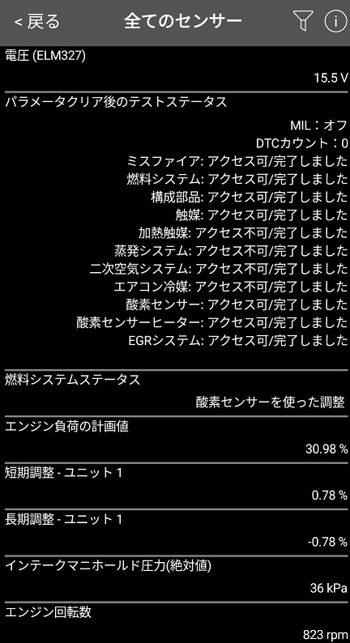
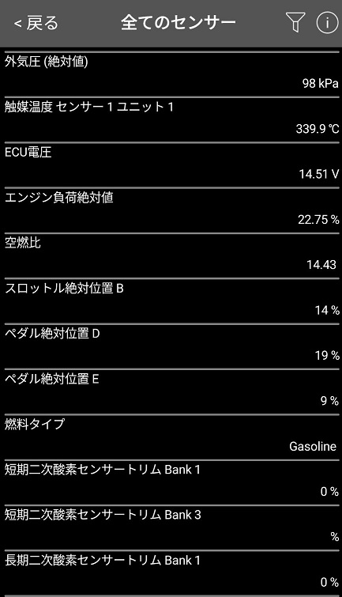

## 使ったもの
- スキャンツール：Vgate ELM327 OBD2スキャナー
    
     
- アプリ：Car Scaner（無料）
  
   
  - Bluetooth接続時のペアリングPINは「1234」（だったはず）
    
     

## クルマ側のOBD2コネクタ位置
運転席右下↓

 

## 読み取れた情報（抜粋）

 

 

 

## 参考
- [Wikipedia - オン・ボード・ダイアグノーシス](https://ja.wikipedia.org/wiki/%E3%82%AA%E3%83%B3%E3%83%BB%E3%83%9C%E3%83%BC%E3%83%89%E3%83%BB%E3%83%80%E3%82%A4%E3%82%A2%E3%82%B0%E3%83%8E%E3%83%BC%E3%82%B7%E3%82%B9)
- [Wikipedia - OBD-II PIDs](https://en.wikipedia.org/wiki/OBD-II_PIDs)

